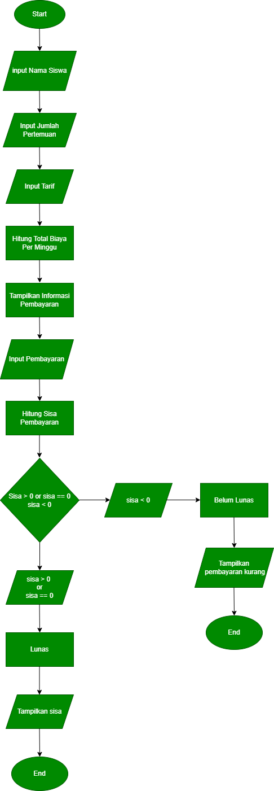

# Program Pembayaran Bimbel Matematika

## STUDI KASUS
Ini adalah program yang digunakan untuk Menghitung biaya Bimbel Matematika selama 1 Minggu. Program ini saya buat berdasarkan pengalaman saya menjadi tutor Bimbel Matematika Sekolah Dasar. Untuk memudahkan  dalam proses pembayaran, Saya membuat program sederhana untuk menghitung biaya bimbingan berdasarkan jumlah pertemuan dan tarif per pertemuan per minggu.

## Tujuan Membuat program:
Menghitung total biaya bimbingan selama 1 minggu.

Menampilkan rincian pembayaran.

Mengelola proses pembayaran dan menampilkan sisa pembayaran jika ada.

## Alur Program
Input Nama siswa

Jumlah pertemuan per minggu

Tarif per pertemuan

Perhitungan Biaya:

Menghitung total biaya dengan rumus:

total_biaya =jumlah pertemuan per minggu * Tarif per pertemuan

Menampilkan Rincian Pembayaran:

Meminta siswa untuk memasukkan jumlah pembayaran yang dilakukan.

Hitung Sisa Pembayaran:

Menghitung sisa pembayaran dengan rumus:

sisa = Pembayaran - total biaya

Menampilkan Hasil:

Jika sisa pembayaran lebih dari nol atau sama dengan nol, tampilkan sisa pembayaran. Maka, muncul pesan Pembayaran sudah lunas

Jika sisa pembayaran kurang dari nol, tampilkan pembayaran kurang. Maka, muncul pesan bahwa pembayaran belum lunas.

## Contoh Hasil Program:
Input

Masukkan nama siswa: Nayla

Masukkan jumlah pertemuan bimbel per minggu: 4

Masukkan tarif per pertemuan: 5000

Rincian Pembayaran

Nama Siswa: Nayla

Jumlah Pertemuan Per Minggu: 4

Tarif Per Pertemuan: Rp 5000.0

Proses

Total Biaya Per Minggu: Rp 20000.0

Masukkan jumlah pembayaran: 50000

Output

Sisa Pembayaran: Rp 30000.0

Pembayaran sudah lunas.

Terima Kasih.

## Flowchart

